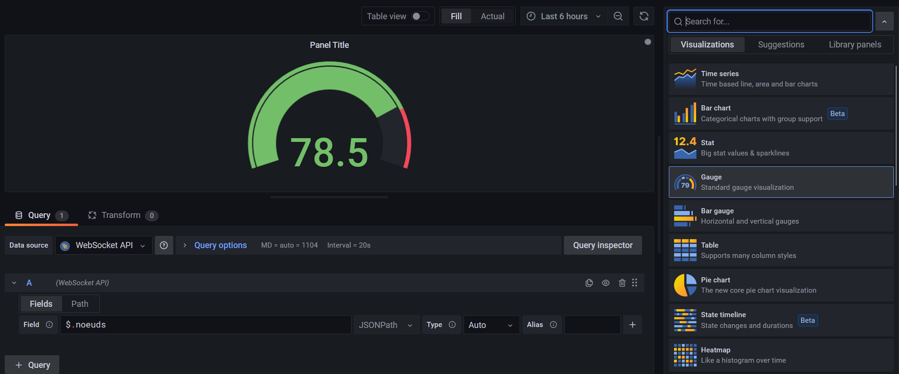

# Grafana-NodeJS-Websocket

By using nodeJS and a WebSocket server, Grafana can allow to display data live. This repo is a small tutorial on how I got it working. 

I am using WSL to run linux on my windows computer. 


## Install grafana 8.5.3 

Install Grafana 8.5.3 to avoid having problems with the websocket. With the newer version we had to reconnect to the websocket everytime. 

Type these commands to install: 
- ```sudo apt-get install -y adduser libfontconfig1```
- ```wget https://dl.grafana.com/oss/release/grafana_8.5.3_amd64.deb```
- ```sudo dpkg -i grafana_8.5.3_amd64.deb```

Once installed type ```systemctl status grafana-server``` to see the status of grafana and ```systemctl start grafana-server``` to start the server. 

Type ```hostname -I``` to determine the IP address. to connect to grafana then type https://[IP_address]:3000 

The default username is 'admin' and the default password is 'admin'. Be sure to set a more secure username and password. 


## Code
There is 2 codes in this repo. The 'CAN_Serial_Grafana.js' has the code to receive CAN messages and serial messages and sending them to grafana. the 'WS_Grafana.js' just sends random data to Grafana. Both use WebSocket. 

Install NodeJS. Install ws by typing ```npm install ws``` to add the websocket library to nodeJS. For the CAN and serial, add ```npm install serialport``` and ```npm install socketcan```.

Launch the code by typing ```node WS_Grafana.js```. 

## Adding Websocket to Grafana
Go to grafana by typing https://[IP_address]:3000.

Go to Configuration > plugins and install the Websocket API. 


Once this is done go to Configuration > Data sources. Add a new data source, select WebSocket API. Set the host as ```ws://IP_ADDRESS:8080```. 


Then create a new dashboard. 

In the datasource select the WebSocket API. In field, add ```$.[FieldName]```. If you type ```$. ``` and go to table view, all the incoming data can be viwed. On the right hand side, the visualisation type can be changed (gauge, time series, ...). The widgets can be easily configured (text size, color scheme, ...) allowing for eay personalisation. 


Once all is correctly set, simply 'Apply' to get the dashboard. 

